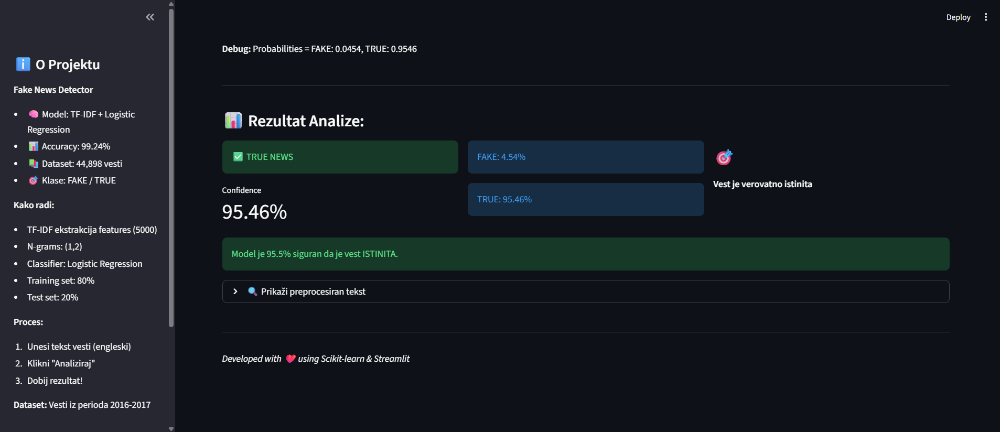
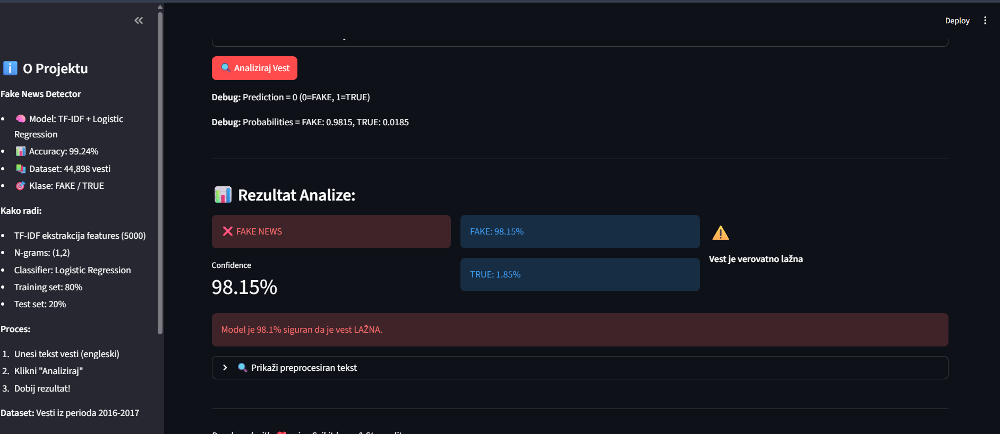

🕵️ Fake News Detection
AI-powered web application for detecting fake news using Natural Language Processing and Machine Learning.

📋 Table of Contents

   -Overview
   -Features
   -Demo
   -Installation
   -Usage
   -Project Structure
   -Model Details
   -Results
   -Limitations
   -Future Work
   -Contributing
   -License

🎯 Overview
This project implements a Fake News Detection System that classifies news articles as either FAKE or TRUE using machine learning techniques. The system includes:

   -Data Analysis: Exploratory Data Analysis (EDA) on 44,898 news articles
   -ML Model: TF-IDF + Logistic Regression (99.24% accuracy)
   -Web Application: Interactive Streamlit interface for real-time predictions

Project Type: AI Application (Tip 2)
Course: Inteligentni Sistemi
Year: 2025/2026

✨ Features

✅ High Accuracy: 99.24% on test dataset
✅ Real-time Predictions: Instant classification of news articles
✅ Confidence Score: Shows model confidence for each prediction
✅ Text Preprocessing: Automated cleaning and normalization
✅ Interactive UI: User-friendly web interface
✅ Debug Mode: Shows raw prediction scores

🖼️ Demo
Web Application Interface
┌─────────────────────────────────────────────────────┐
│  🕵️ Fake News Detector                              │
│  Detektuj lažne vesti pomoću AI modela!             │
├─────────────────────────────────────────────────────┤
│                                                      │
│  📝 Unesi tekst vesti:                              │
│  ┌────────────────────────────────────────────────┐│
│  │ [Paste news article here...]                   ││
│  │                                                 ││
│  └────────────────────────────────────────────────┘│
│                                                      │
│           [🔍 Analiziraj Vest]                      │
│                                                      │
│  ──────────────────────────────────────────────────│
│  📊 Rezultat Analize:                               │
│                                                      │
│  ❌ FAKE NEWS        Score: 0.0147      ⚠️          │
│  Confidence: 98.53%                                 │
│                                                      │
│  Model je 98.5% siguran da je vest LAŽNA.          │
└─────────────────────────────────────────────────────┘

🚀 Installation
Prerequisites

Python 3.12 or higher
pip (Python package manager)
Git

Step 1: Clone Repository
bashgit clone https://github.com/darelony/Fake_news_detection.git
cd Fake_news_detection
Step 2: Create Virtual Environment
Windows:
bashpython -m venv venv
venv\Scripts\activate
Mac/Linux:
bashpython3 -m venv venv
source venv/bin/activate
Step 3: Install Dependencies
bashpip install -r requirements.txt
Step 4: Download Dataset (Optional - for training)
If you want to retrain the model:

Download from Kaggle
Extract to data/ folder:

   data/
   ├── Fake.csv
   └── True.csv

💻 Usage
Running the Web Application
bashstreamlit run app.py
The application will automatically open in your browser at http://localhost:8501
Using the Jupyter Notebook
bashjupyter notebook fake_news-detection.ipynb
Or open fake_news-detection.ipynb in VS Code.

📁 Project Structure
Fake_news_detection/
│
├── data/                           # Dataset folder
│   ├── Fake.csv                   # Fake news articles
│   └── True.csv                   # True news articles
│
├── app.py                         # Streamlit web application
├── fake_news-detection.ipynb     # Jupyter notebook (full analysis)
│
├── tfidf_vectorizer.pkl          # Trained TF-IDF vectorizer
├── lr_model.pkl                  # Trained Logistic Regression model
├── tokenizer.pkl                 # Text tokenizer
├── config.pkl                    # Model configuration
│
├── requirements.txt              # Python dependencies
├── .gitignore                    # Git ignore file
└── README.md                     # This file

🧠 Model Details
Architecture
Model Type: TF-IDF + Logistic Regression
Pipeline:

Text Preprocessing:

Lowercase conversion
URL removal
Special character removal
Tokenization

Feature Extraction:

TF-IDF Vectorization
Max features: 5,000
N-grams: (1, 2)

Classification:

Algorithm: Logistic Regression
Solver: lbfgs
Max iterations: 1000

Training

Dataset Size: 44,898 news articles

Fake news: 23,481
True news: 21,417

Train/Test Split: 80/20
Cross-validation: Stratified split

📊 Results
Performance Metrics
MetricScoreAccuracy99.24%Precision (FAKE)99%Precision (TRUE)99%Recall (FAKE)99%Recall (TRUE)99%F1-Score99%
Confusion Matrix
                 Predicted
              FAKE    TRUE
Actual FAKE   4650     46
       TRUE     22   4262

⚠️ Limitations
Temporal Domain Shift
The model is trained on news articles from 2016-2017 period. It may have reduced accuracy on:

News articles from 2020 onwards
Different writing styles or formats
Very short or generic text

Reason: Language patterns, topics, and writing styles change over time.
Recommendations for Production:

Dataset augmentation - Add contemporary news articles
Transfer learning - Use pre-trained BERT models
Hybrid approach - Combine with LLMs (GPT-4, Claude)
Continuous learning - Regular retraining with new data

🔮 Future Work

 Add multilingual support (Serbian, other languages)
 Implement BERT-based model for better generalization
 Create API endpoint for integration
 Add news source credibility scoring
 Implement explainability features (why fake/true)
 Mobile application development
 Real-time news monitoring system

🤝 Contributing
Contributions are welcome! Please feel free to submit a Pull Request.
Steps:

Fork the repository
Create your feature branch (git checkout -b feature/AmazingFeature)
Commit your changes (git commit -m 'Add some AmazingFeature')
Push to the branch (git push origin feature/AmazingFeature)
Open a Pull Request

📝 License
This project is part of an academic assignment for the Inteligentni Sistemi course.

👨‍💻 Author
Darko Relony

GitHub: @darelony
Project: Fake_news_detection

🙏 Acknowledgments

Dataset: Kaggle - Fake and Real News Dataset
Course: Inteligentni Sistemi, Elektrotehnički fakultet Niš
Frameworks: Scikit-learn, Streamlit, NLTK

📚 References

Clément Bisaillon. (2020). Fake and Real News Dataset. Kaggle.
Pedregosa et al. (2011). Scikit-learn: Machine Learning in Python. JMLR.
Natural Language Toolkit (NLTK). nltk.org

⭐ If you find this project useful, please consider giving it a star!